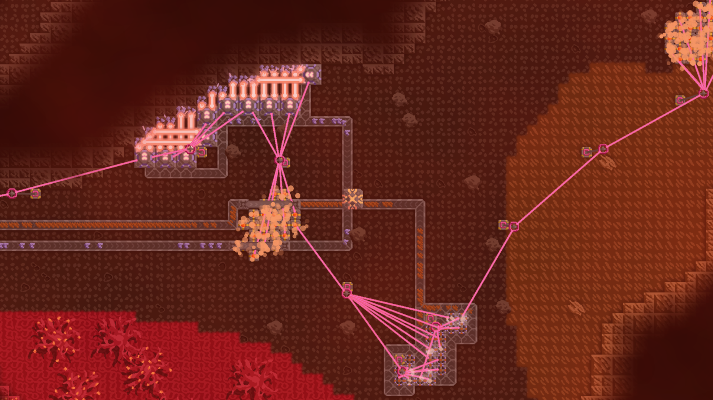

<!-- when the midgame image will appear, i will make the logo here a bit more cool -->
![logo]
 

# Java mod for Mindustry. Will eventually overgrow everything.
### Links
![commitb]  <!--totally not stolen from another mod-->
[![discordb]][discord]
## About

The mod has lots of ideas for what to add, and they keep on coming. Most of the ideas are taken from other mods. Basically, Technologium is a combination of the best out of Mindustry mods and itself.  
While others try not to add too much, we try to add as much as we can.

There will be easy and hard maps, lore, lots of secrets and new mechanics. There'll be fun moments as well ;).

The mod will constantly<!-- who would believe this --> update, adding more and more new things. I (retodera) do not plan to stop adding new content. We will milk everything out of Java, and make a new Mindustry.

## Overview

### Content
Previously, there was a count of each block, unit, etc. but now, there's just too much of them.  
Besides adding new content, the mod adds lots of other things, most of which can be seen in the corresponding settings category.  

The most important thing in the mod is **PRODUCTION**. Mass **production**, to be more exact. There will be tonns of items, ways to produce and use them. Advanced things will be very costly.  

Another main thing in the mod is lots of purely and *almost* purely new content.  

Also, there are lots of new mechanics

### Gameplay // WARNING: SPOILERS
Here's how it all starts:  
First sector, basic technology.

Then, it gets to this:  
 <!-- spoiler: no chaos -->
After the tutorial comes the midgame:  
 <!-- spoiler: chaos -->
And finally, the endgame:  
 <!-- spoiler: total chaos -->

### Have fun!
![cat]

<!-- Congratulations. You have read me. Was it worth it? -->

[discordb]: https://img.shields.io/discord/1320403715483762780?style=for-the-badge&label=discord
[commitb]: https://img.shields.io/github/last-commit/retodera/technologium?style=for-the-badge&label=last%20commit
[discord]: https://discord.gg/x3D2Qbadmb
[logo]: assets/sprites/ui/logo/tlogo.png
[cat]: assets/sprites/ui/cat.png